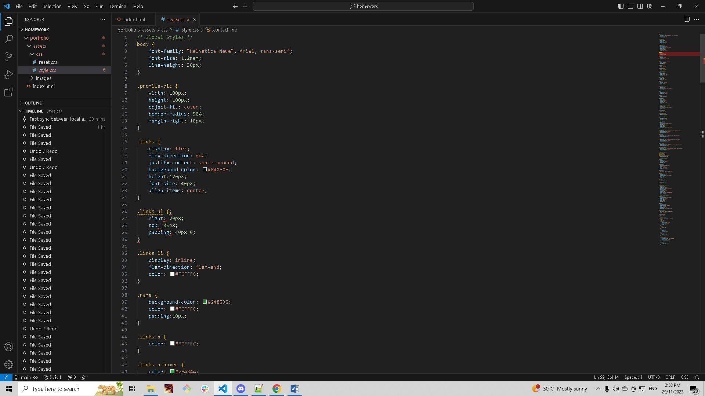
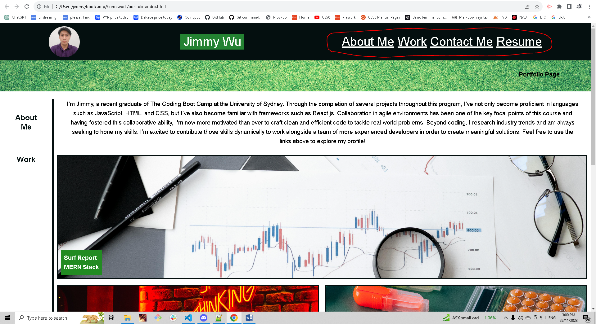

# Jimmy-Wu-Work-Portfolio
## Codebase for Jimmy Wu's Work Portfolio

## Description
The purpose of this project was to create a usable portfolio webpage to showcase past work to potential employers. The HTML and CSS were written from scratch and (refer to index.html and style.css inside assets > css > style.css) overall accessibility of the website was taken into consideration. This portfolio page will make it easy for employers to navigate through projects completed through the University of Sydney/edX Coding Bootcamp as well as future projects using straightforward and accessible website links. With readability and accessbility in mind as well as user engagement, this webpage incorporates matching colors from a color palette to ensure that a visual hierarchy is established, guiding users' attention to important elements.

## Learnings/takeaways
Takeaways from completing this project include the application of concepts surrounding flexbox properties, particularly when it came to the cards' layout on the webpage. Having multiple flexboxes bundled within one another alongside appropriate usage of div elements allowed for the projects' cards to display as desired. Designing a wireframe prior to writing up corresponding HTML code also assisted in this process. 

        
## Installation
N/A

## Usage 
Go to link: https://jpwu23.github.io/Jimmy-Wu-Portfolio/ Navigate across the webpage to gain insight on Jimmy Wu's work profile by clicking on the links to the corresponding sections using the navigation bar at the top of the webpage.

## Credits
ChatGPT, University of Sydney/edX Coding Bootcamp course resources. 

## License
N/A
